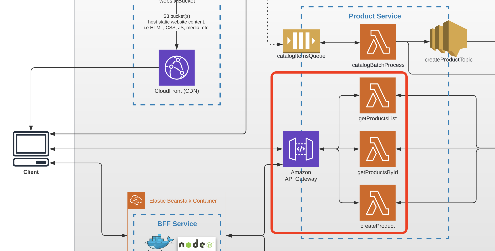

# Task 3 (First API with AWS API Gateway and AWS Lambda)

## Prerequisites

---

- **Install** the latest version of Serverless Framework (https://www.serverless.com/).
- **Configure** credentials for AWS to make them accessible by Serverless.
- **Create** your **own public Github repository** for all future backend work (you might call it how you would like). You will have 2 repos - 1 for frontend, 1 for backend till the end of course.

_NOTE: You should create branch from master and work in branch (f.e. branch name - task-3) in BE (backend) and in FE (frontend) repositories._

_NOTE: Don't forget to add dynamic product representation on FE side._

_NOTE: This microservice needs to be created using Serverless Framework, AWS API Gateway, AWS Lambda._

## Architecture

Find the entire program architecture: [here](../Architecture.pdf).

<details>
  <summary>Task Focus</summary>

  The following image provides more info about task focus.

  

</details>

## Tasks

---

### Task 3.1

1. Create a lambda function called `getProductsList` under the same Serverless config file (i.e. `serverless.yaml`) of Product Service which will be triggered by the HTTP GET method.
2. The requested URL should be `/products`.
3. The response from the lambda should be a _full_ array of products (mock data should be used - this mock data should be stored in Product Service).
4. This endpoint should be integrated with Frontend app for _PLP_ (Product List Page) representation.

### Task 3.2

1. Create a lambda function called `getProductsById` under the same Serverless config file (i.e. `serverless.yaml`) of Product Service which will be triggered by the HTTP GET method.
2. The requested URL should be `/products/{productId}` (what `productId` is in your application is up to you - productName, UUID, etc.).
3. The response from the lambda should be 1 searched product from an array of products (mock data should be used - this mock data should be stored in Product Service).
4. This endpoint is not needed to be integrated with Frontend right now.

### Task 3.3

1. Commit all your work to separate branch (e.g. `task-3` from the latest `master`) in your own repository.
2. Create a pull request to the `master` branch.
3. Submit link to the pull request to Crosscheck page in [RS App](https://app.rs.school).

## Evaluation criteria (each mark includes previous mark criteria)

---

Reviewers should verify the lambda functions by invoking them through provided URLs.

- **1** - Product Service Serverless config contains configuration for 2 lambda functions, API is not working at all, but YAML configuration is correct
- **2** - The `getProductsList` OR `getProductsById` lambda function returns a correct response (POINT1)
- **3** - The `getProductsById` AND `getProductsList` lambda functions return a correct response code (POINT2)
- **4** - Your own Frontend application is integrated with Product Service (`/products` API) and products from Product Service are represented on Frontend. AND POINT1 and POINT2 are done.

## Additional (optional) tasks

---

- **+1** - Async/await is used in lambda functions
- **+1** - ES6 modules are used for Product Service implementation
- **+1** - Custom Webpack/ESBuild/etc is manually configured for Product Service. Not applicable for preconfigured/built-in bundlers that come with templates, plugins, etc. 
- **+1** **(All languages)** - SWAGGER documentation is created for Product Service
- **+1** **(All languages)** - Lambda handlers are covered by basic UNIT tests (NO infrastructure logic is needed to be covered)
- **+1** **(All languages)** - Lambda handlers (`getProductsList`, `getProductsById`) code is written not in 1 single module (file) and separated in codebase.
- **+1** **(All languages)** - Main error scenarios are handled by API ("Product not found" error).

## Description Teamplate for PRs

---

The following should be present in PR's description field:

1. What was done?

   Example:

```
   Service is done, but FE is not working...

   Additional scope - webpack, swagger, unit tests
```

2. Link to Product Service API - .....
3. Link to FE PR (YOUR OWN REPOSITORY) - ...

4. In case SWAGGER file is not provided - please provide product schema in PR description
