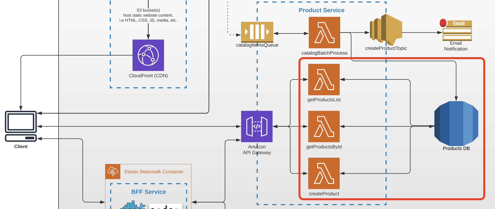

# Task 4 (Integration with Database)

## Architecture

Find the entire program architecture: [here](../Architecture.pdf).

<details>
  <summary>Task Focus</summary>

  The following image provides more info about task focus.

  

</details>

## Tasks

---

### Task 4.1

1. Use AWS Console to create two database tables in DynamoDB. Expected schemas for products and stocks:

Product model:

```
  products:
    id -  uuid (Primary key)
    title - text, not null
    description - text
    price - integer
```

Stock model:

```
  stocks:
    product_id - uuid (Foreign key from products.id)
    count - integer (Total number of products in stock, can't be exceeded)
```

2. Write a script to fill tables with test examples. Store it in your Github repository. Execute it for your DB to fill data.

### Task 4.2

1. Extend your `serverless.yml` file with data about your database table and pass it to lambda’s environment variables section.
2. Integrate the `getProductsList` lambda to return via GET `/products` request a list of products from the database (joined stocks and products tables).
3. Implement a Product model on FE side as a joined model of product and stock by `productId`. For example:

_BE: Separate tables in DynamoDB_

```
  Stock model example in DB:
  {
    product_id: '19ba3d6a-f8ed-491b-a192-0a33b71b38c4',
    count: 2
  }


  Product model example in DB:
  {
    id: '19ba3d6a-f8ed-491b-a192-0a33b71b38c4'
    title: 'Product Title',
    description: 'This product ...',
    price: 200
  }
```

_FE: One product model as a result of BE models join (product and it's stock)_

```
  Product model example on Frontend side:
  {
    id: '19ba3d6a-f8ed-491b-a192-0a33b71b38c4',
    count: 2
    price: 200,
    title: ‘Product Title’,
    description: ‘This product ...’
  }
```

_NOTE: This setup means User cannot buy more than `product.count` (no more items in stock) - but this is future functionality on FE side._

4. Integrate the `getProductsById` lambda to return via GET `/products/{productId}` request a single product from the database. **Do not commit your environment variables in serverless.yml to github!**

### Task 4.3

1. Create a lambda function called `createProduct` under the same Serverless config file (i.e. `serverless.yaml`) of Product Service which will be triggered by the HTTP POST method.
2. The requested URL should be `/products`.
3. Implement its logic so it will be creating a new item in a Products table.
4. Save the URL (API Gateway URL) to execute the implemented lambda functions for later - you'll need to provide it in the PR (e.g in PR's description) when submitting the task.

### Task 4.4

1. Commit all your work to separate branch (e.g. `task-4` from the latest `master`) in BE (backend) and if needed in FE (frontend) repositories.
2. Create a pull request to the `master` branch.
3. Submit the link to the pull request fro crosscheck

## Evaluation criteria (each mark includes previous mark criteria)

---

Reviewers should verify the lambda functions by invoking them through provided URLs.

- **1** - Task 4.1 is implemented
- **3** - Task 4.2 is implemented lambda links are provided and returns data
- **4** - Task 4.3 is implemented lambda links are provided and products is stored in DB (call Task 4.2 to see the product)
- **5** - Your own Frontend application is integrated with Product Service (`/products` API) and products from Product Service are represented on Frontend. Link to a working Frontend application is provided for cross-check reviewer.

## Additional (optional) tasks

---

- **+1** **(All languages)** - POST `/products` lambda functions returns error 400 status code if product data is invalid
- **+1** **(All languages)** - All lambdas return error 500 status code on any error (DB connection, any unhandled error in code)
- **+1** **(All languages)** - All lambdas do `console.log` for each incoming requests and their arguments
- **+1** **(All languages)** - Use RDS instance instead fo DynamoDB tables
- **+1** **(All languages)** - Transaction based creation of product (in case stock creation is failed then related to this stock product is not created and not ready to be used by the end user and vice versa) (https://devcenter.kinvey.com/nodejs/tutorials/bl-transactional-support, https://docs.aws.amazon.com/amazondynamodb/latest/developerguide/transaction-apis.html)

## Description Template for PRs

---

The following should be present in PR's description field:

1. What was done?

   Example:

```
   Service is done, but FE is not working...

   Additional scope - logger, swagger, unit tests, transaction
```

2. Link to Product Service API - .....
3. Link to FE PR (YOUR OWN REPOSITORY) - ...
4. In case SWAGGER file is not provided - please provide product schema in PR description
