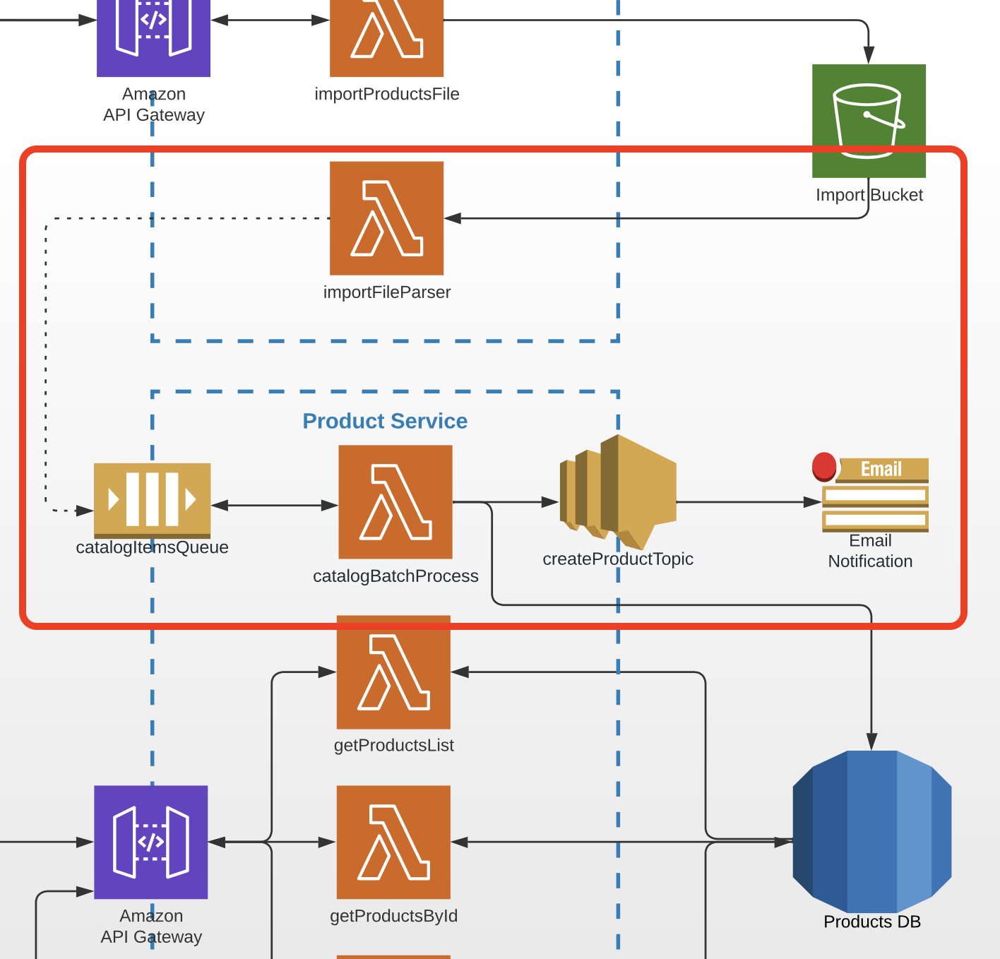

# Task 6 (SQS & SNS, Async Microservices Communication)

## Prerequisites

---

- The task is a continuation of Homework 5 and should be done in the same repo
- Task goal is to create a service to be able to save products which were provided in csv file in database.

## Architecture

Find the entire program architecture: [here](../Architecture.pdf).

<details>
  <summary>Task Focus</summary>

  The following image provides more info about task focus.

  

</details>

## Tasks

---

### Task 6.1

1. Create a lambda function called `catalogBatchProcess` under the same Serverless config file (i.e. `serverless.yaml`) of the Product Service which will be triggered by an SQS event.
2. Create an SQS queue called `catalogItemsQueue`, in the resources section of the same `serverless.yml` file.
3. Configure the SQS to trigger lambda `catalogBatchProcess` with _5 messages_ at once via `batchSize` property.
4. The lambda function should iterate over all SQS messages and create corresponding products in the products table.

### Task 6.2

1. Update the `importFileParser` lambda function in the Import Service to send each CSV record into SQS.
2. It should no longer log entries from the _readable stream_ to CloudWatch.

### Task 6.3

1. Create an SNS topic `createProductTopic` and email subscription in the resources section in `serverless.yml` of the Product Service.
2. Create a subscription for this SNS topic with an `email` endpoint type with your own email in there.
3. Update the `catalogBatchProcess` lambda function in the Product Service to send an event to the SNS topic once it creates products.

### Task 6.4

1. Commit all your work to separate branch (e.g. `task-6` from the latest `master`) in your own repository.
2. Create a pull request to the `master` branch.
3. Submit link to the pull request to Crosscheck page in [RS App](https://app.rs.school).

## Evaluation criteria (each mark includes previous mark criteria)

---

Reviewers should verify the lambda functions, SQS and SNS topic and subscription in PR.

- **1** - File `serverless.yml` contains configuration for `catalogBatchProcess` function
- **2** - File `serverless.yml` contains policies to allow lambda `catalogBatchProcess` function to interact with SNS and SQS
- **3** - File `serverless.yml` contains configuration for SQS `catalogItemsQueue`
- **4** - File `serverless.yml` contains configuration for SNS Topic `createProductTopic` and email subscription

## Additional (optional) tasks

---

- **+1** **(All languages)** - `catalogBatchProcess` lambda is covered by **unit** tests
- **+1** **(All languages)** - set a Filter Policy for SNS `createProductTopic` in `serverless.yml` and create an additional email subscription to distribute messages to different emails depending on the filter for any product attribute

## Description Teamplate for PRs

---

The follwoing should be present in PR's description field:

1. What was done?

   Example:

```
   Service is done, but FE is not working...

   Additional scope - webpack, swagger, unit tests
```

2. Link to Product Service and Import Service APIs - .....
3. Link to FE PR (YOUR OWN REPOSITORY) - ...

4. In case SWAGGER file is not provided - please provide product schema in PR description
