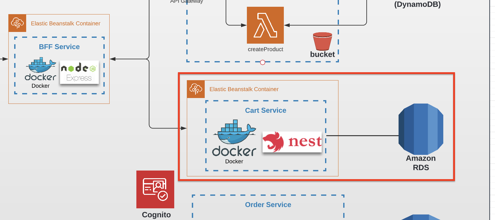

# Task 8 (Integration with SQL Database)

## Architecture

Find the entire program architecture: [here](../Architecture.pdf).

<details>
  <summary>Task Focus</summary>

  The following image provides more info about task focus.

  

</details>

## Tasks

---

### Task 8.1

1. Fork a copy of [Cart Service template repository](https://github.com/boale/rs-cart-api)
2. Use the guide (https://docs.nestjs.com/faq/serverless) to integrate Nest.js application with serverless. 
3. Deploy your code to AWS Lambda

_Actually, it's not recommended having routing inside AWS Lambda, since it can be done by other services such as API Gateway.
But it's the easiest way to deploy application, and it's done only for educational approaches._   


### Task 8.2

1. Use AWS Console to create a database instance in RDS with PostgreSQL and default configuration.
2. Connect to database instance via a tool called [DBeaver](https://dbeaver.io/download/) or any other similar tools like DataGrip/PgAdmin
3. Create the following tables:

Cart model:

```
  carts:
    id - uuid (Primary key)
    user_id - uuid, not null (It's not Foreign key, because there is no user entity in DB)
    created_at - date, not null
    updated_at - date, not null
```

Cart Item model:

```
  cart_items:
    cart_id - uuid (Foreign key from carts.id)
    product_id - uuid
    count - integer (Number of items in a cart)
```


4. Write SQL script to fill tables with test examples. Store it in your Github repository. Execute it for your DB to fill data.

### Task 8.3

1. Change logic in application to use PostgreSQL
2. Integrate with RDS
3. It's recommended to use [pg](https://www.npmjs.com/package/pg) module to connect the database from the code.
4. Extend your `serverless.yml` file with credentials to your database instance and pass it to lambda’s environment variables section.


### Task 8.4

1. Commit all your work to separate branch (e.g. `task-8` from the latest `master`) in your new repository.
2. Create a pull request to the `master` branch.
3. Submit the link to the pull request for crosscheck


## Evaluation criteria (each mark includes previous mark criteria)

---

Reviewers should verify the lambda functions by invoking them through provided URLs.

- **30** - Task 8.1 is implemented
- **60** - Task 8.2 is implemented
- **80** - Task 8.3 is implemented lambda links are provided and cart's data is stored in DB

## Additional (optional) tasks

---

- **+20** **(All languages)** - Create orders table and integrated with it
Order model:
```
  orders:
    id - uuid
    user_id - uuid
    cart_id - uuid (Foreign key from carts.id)
    payment - JSON
    delivery - JSON
    comments - text
    status - ENUM or text
    total - number
```
- **+1** **(All languages)** - Create users table and integrate with it
- **+1** **(All languages)** - Transaction based creation of checkout
- **+1** **(All languages)** - Integrate Cart service with FE repository

## Description Template for PRs

---

The following should be present in PR's description field:

1. What was done?

   Example:

```
   Service is done, but creation is not working...

   Additional scope - transaction, FE
```

2. Link to Cart Service API - .....
3. Link to FE PR (YOUR OWN REPOSITORY) - ...
