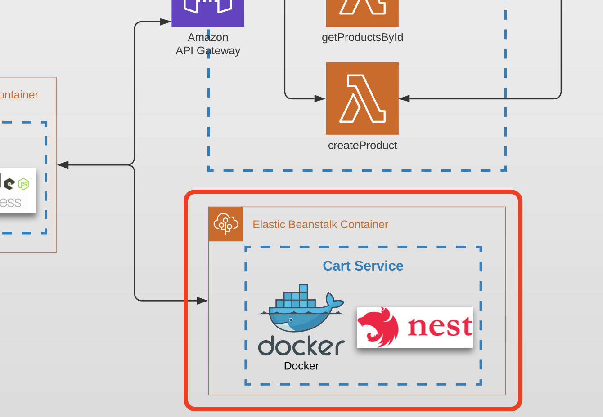

# Task 8 (Docker and AWS Elastic Beanstalk)

## Prerequisites

---

- [AWS EB CLI](https://docs.aws.amazon.com/elasticbeanstalk/latest/dg/eb-cli3-install.html) must be installed
- [Docker](https://docs.docker.com/get-docker/) must be installed

## Architecture

Find the entire program architecture: [here](../Architecture.pdf).

<details>
  <summary>Task Focus</summary>

   The following image provides more info about task focus.

  

</details>

## Tasks

---

### Task 8.1

1. Fork a copy of [Cart Service template repository](https://github.com/boale/rs-cart-api)

2. **Create** Dockerfile that will build a docker image to run the Cart Service. 

3. Make sure to perform the following steps:

- Add `.dockerignore` file to minimize build context. 
- Files and folders generated by the application or npm should be excluded.
- Provide explanations to why the folder was ignored.

3. **Optimize** your image/container

- Minimize docker image size to be `less than 500 MB`.
- Optimize image build times. Dockerfile commands that run npm install should not depend on typescript files.
- _OPTIONAL: add more folders to `.dockerignore` with explanations_
- _OPTIONAL: Minimize docker image size to `about 100 MB`._
- _OPTIONAL: Optimize build times by utilizing multistage builds._
- _OPTIONAL: Lint Dockerfile._

### Task 8.2

1. Prepare Cart Service infrastructure with Elastic Beanstalk.

- **Use** a `Dockerfile` from previous subtask to deploy your Cart Service using AWS Beanstalk CLI.
- **Initiate** an Elastic Beanstalk application using the `eb init` command. Application name must follow the following convention `{yours_github_account_login}-cart-api`.
- **Create** a new environment using the `eb create` command. An environment name must be short _but not less then four signs_ (e.g _develop_, _test_, _prod_, etc). Use the `--cname` option `{yours_github_account_login}-cart-api-{environment_name}` so that Elastic Beanstalk will use it to create a proper domain name. Use the `--single` option to not use any Load Balancer for this environment.

2. Deploy Cart Service with Elastic Beanstalk

- **Investigate** AWS Elastic Beanstalk service in the AWS Console. 
- **Walk through** EC2 resources that were created by Elastic Beanstalk
- **Update** the app and deploy changes using the `eb deploy` command.

3. Update FE app 

- **Pull** the latest version of the app from repo
- **Replace** Cart Service placeholder in `src/constants/apiPaths.ts` using a Cart Service API URL you get after successful deployment. 
- **Make sure** your app starts to call Cart Service API when you add or remove items. 

_NOTE: Now after page refresh cart’s content might remain the same._

### Task 8.3

1. Commit all your work to separate branch (e.g. `task-8` from the latest `master`) in your own repository.
2. Create a pull request to the `master` branch.
3. Submit link to the pull request to Crosscheck page in [RS App](https://app.rs.school).

## Evaluation criteria (each mark includes previous mark criteria)

---

- **1** - `Dockerfile` is prepared, image is building. Image size is minimized to be less than 500 MB.
- **2** - `Dockerfile` is optimized. Files that change more often and commands that depend on them should be included later, files and commands that change less should be at the top.
- **3** - Folders are added to .dockerignore, with explanations. At least 2 big directories should be excluded from build context. Elastic Beanstalk application is initialized.
- **4** - Environment is created and the app is deployed to the AWS cloud. You must provide a link to your GitHub repo with Cart Service API or PR with created `Dockerfile` and related configurations.
- **5** - FE application is updated with Cart API endpoint. You must provide a PR with updates in your FE repository and OPTIONALLY link to deployed front-end app which makes proper API calls to your Cart Service.

## Description Teamplate for PRs

---

The follwoing should be present in PR's description field:

1. What was done?

   Example:

```
   Service is done, but FE is not working...

   Additional scope - webpack, swagger, unit tests
```

2. Link to Cart Service API - .....
3. Link to FE PR (YOUR OWN REPOSITORY) - ...

4. In case SWAGGER file is not provided - please provide product schema in PR description
